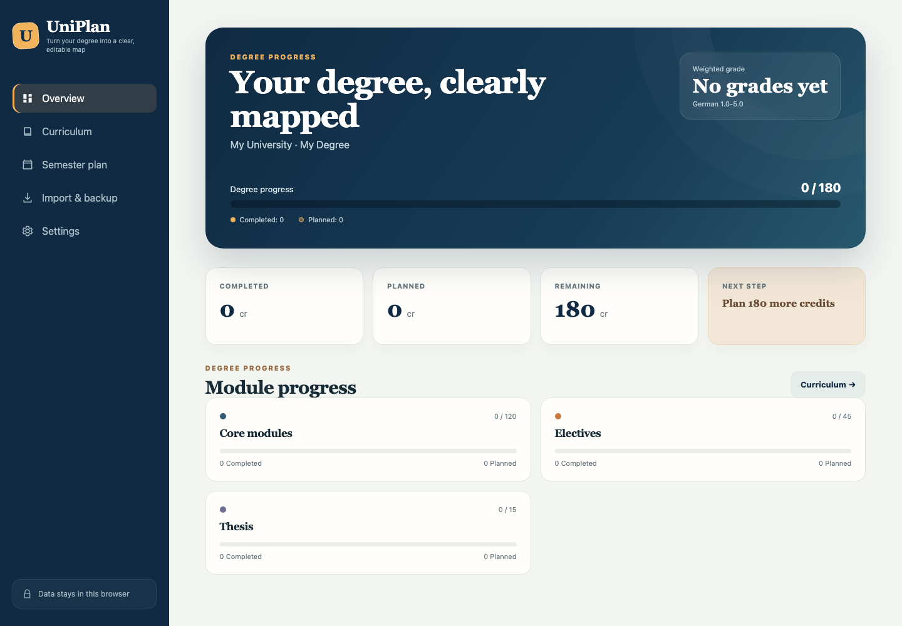
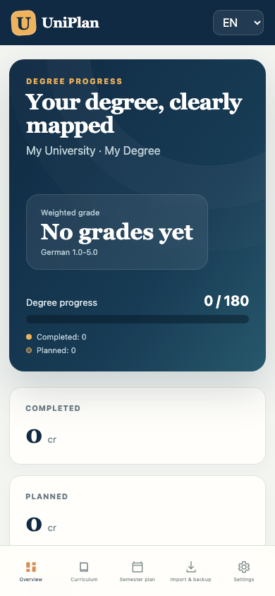

# UniPlan

**A private, local-first degree planner for courses, credits, semesters, and grades.**

UniPlan helps students turn a university curriculum into an editable study plan.
It runs entirely in the browser: there is no account, no backend, no AI API,
and no token usage. Personal details and grades stay on the user's device unless
the user explicitly exports a backup.

> Status: early public release. The core planner is functional, but university
> templates should always be checked against the official examination rules.

## Screenshots

| Desktop | Mobile |
| --- | --- |
|  |  |

## Why UniPlan?

University regulations are often published as long PDFs, tables, or scattered
web pages. Students then maintain separate spreadsheets for credits, semester
loads, electives, and grades. UniPlan keeps these tasks in one reusable app:

- choose an existing curriculum template or start from a blank degree;
- edit modules and courses without changing application code;
- plan courses across semesters and monitor workload;
- record completed credits and calculate a weighted grade;
- export the complete plan before changing devices;
- share curriculum files without sharing personal progress.

## Features

- **Local-first privacy:** all data is stored in browser `localStorage`.
- **No AI cost:** normal use and curriculum imports consume no model tokens.
- **Three interface languages:** English, Chinese, and German.
- **Editable curriculum:** add, edit, move, or remove modules and courses.
- **Semester planning:** assign courses to semesters and track semester credit load.
- **Progress tracking:** separate available, planned, and completed courses.
- **Weighted grades:** support German grades, US GPA, and percentage labels.
- **Pass/fail support:** exclude selected courses from the weighted average.
- **Portable data:** import and export UniPlan JSON files.
- **CSV import:** create deterministic curriculum templates without AI parsing.
- **Built-in templates:** a blank curriculum and an FAU Artificial Intelligence
  bachelor example.
- **Installable PWA:** install from a supported browser and reopen the cached app
  shell offline.
- **Responsive design:** desktop and mobile layouts are both supported.

## Quick Start

### Requirements

- Node.js 20.19 or newer
- npm 10 or newer

### Run locally

```bash
# Clone the repository from GitHub first, then:
cd uniplan
npm install
npm run dev
```

Open the URL printed by Vite, normally <http://localhost:5173>.

### Validate a change

```bash
npm test
npm run build
```

The production output is written to `dist/`.

## Using the Planner

1. Open **Settings** and enter the university, degree, regulation version,
   required credits, number of semesters, grading system, and interface language.
2. Open **Curriculum** to create modules and courses.
3. Mark a course as **Available**, **Planned**, or **Completed**.
4. Assign planned courses to semesters.
5. Enter grades for completed courses. Mark pass/fail courses as excluded from
   the average when appropriate.
6. Open **Import & backup** regularly and export a JSON backup.

## Curriculum Templates

The UI is independent from any specific university. A curriculum is represented
by JSON containing:

- degree metadata;
- grading and semester settings;
- module credit requirements;
- individual courses, prerequisites, availability, status, semester, and grade.

See [Data Format](docs/data-format.md) for the complete schema and CSV columns.

The included FAU template is an editable example, not an official source. Course
availability and degree regulations can change, so users must compare templates
with current university documentation.

## Import and Backup

### JSON

JSON exports contain both the curriculum and the current user's progress. They
are intended for backup and complete restoration.

### CSV

CSV is useful for building or reviewing curriculum templates in a spreadsheet.
Download the sample CSV from **Import & backup** or use the column definition in
[Data Format](docs/data-format.md).

All import parsing happens locally in the browser. Importing replaces the current
plan, so export a backup first.

## Privacy Model

UniPlan has no server-side database, analytics, authentication, or AI integration.
The application stores one JSON document under:

```text
uniplan.plan.v1
```

This provides strong default privacy, but it also means:

- data does not automatically sync between browsers or devices;
- clearing site data removes the local plan;
- private/incognito sessions may discard data when the session closes;
- anyone with access to an exported JSON file can read its contents.

Users should keep exported backups in a location they trust.

## Deployment

### CodeSandbox

After this repository is available on GitHub:

1. Open the CodeSandbox dashboard.
2. Close the template creation dialog if it is open.
3. Select **Import** near the top-right corner.
4. Connect GitHub if requested.
5. Select or paste the URL of this repository.
6. Use `npm run dev` if CodeSandbox asks for a start command.

Detailed instructions are available in [Deployment](docs/deployment.md).

### GitHub Pages

The included `deploy-pages.yml` workflow builds and deploys the app. In the
repository settings, open **Pages** and select **GitHub Actions** as the source.
Every push to `main` then publishes a new version.

The Vite build uses relative asset paths, so it works both at a domain root and
inside a repository subpath.

## Project Structure

```text
uniplan/
├── .github/workflows/     CI and GitHub Pages deployment
├── docs/                  Data format and deployment documentation
├── public/                PWA manifest, service worker, and icon
├── src/
│   ├── App.jsx            Application UI and interactions
│   ├── i18n.js            English, Chinese, and German translations
│   ├── templates.js       Blank and FAU example curricula
│   ├── utils.js           Storage, statistics, import, and export helpers
│   ├── utils.test.js      Data-model tests
│   └── styles.css         Responsive visual design
├── index.html
├── package.json
└── vite.config.js
```

## Architecture

UniPlan intentionally keeps the first version simple:

- React renders the interface.
- Vite handles development and static production builds.
- `localStorage` persists one plan per browser profile.
- JSON is the canonical exchange format.
- CSV is converted into the same JSON model.
- A service worker caches the static app shell.

There is no hidden dependency on OpenAI, ChatGPT, Codex, or another hosted
model. A future optional assistant may convert difficult curriculum PDFs into
UniPlan JSON, but that would remain separate from the core planner.

## Roadmap

- community-maintained university template library;
- import preview and validation before replacing a plan;
- curriculum-only exports without personal progress;
- prerequisite warnings and rule validation;
- drag-and-drop semester planning;
- optional encrypted cloud synchronization;
- optional PDF-to-JSON helper using a user-provided model or local model.

## Contributing

Contributions are welcome, especially curriculum templates, translations,
accessibility improvements, tests, and import validation. Read
[CONTRIBUTING.md](CONTRIBUTING.md) before opening a pull request.

Please do not commit personal grades, student identifiers, or private university
documents.

## Security

See [SECURITY.md](SECURITY.md) for reporting security or privacy issues.

## License

UniPlan is released under the [MIT License](LICENSE).
